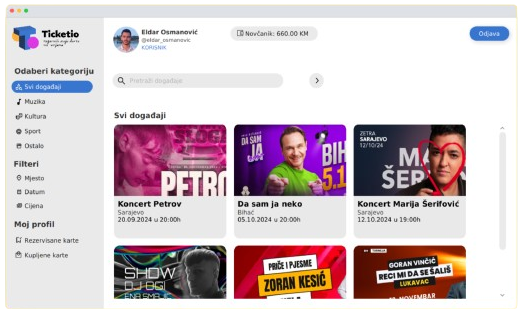

<!-- Improved compatibility of back to top link: See: https://github.com/othneildrew/Best-README-Template/pull/73 -->
<a id="readme-top"></a>
<!--
*** Thanks for checking out the Best-README-Template. If you have a suggestion
*** that would make this better, please fork the repo and create a pull request
*** or simply open an issue with the tag "enhancement".
*** Don't forget to give the project a star!
*** Thanks again! Now go create something AMAZING! :D
-->


<!-- PROJECT SHIELDS -->
<!--
*** I'm using markdown "reference style" links for readability.
*** Reference links are enclosed in brackets [ ] instead of parentheses ( ).
*** See the bottom of this document for the declaration of the reference variables
*** for contributors-url, forks-url, etc. This is an optional, concise syntax you may use.
*** https://www.markdownguide.org/basic-syntax/#reference-style-links
-->


<!-- PROJECT LOGO -->
<br />
<div align="center">
  <a href="https://github.com/othneildrew/Best-README-Template">
    
  </a>

  <h3 align="center">System for booking and buying tickets.</h3>

  <p align="center">
    Project for the Software Development course at the Faculty of Electrical Engineering in Tuzla.
    <br />
    <a href="https://github.com/oeldar/RS-Projekat/tree/master"><strong>Explore the docs »</strong></a>
    <br />
  </p>
</div>


<!-- TABLE OF CONTENTS -->
<details>
  <summary>Table of Contents</summary>
  <ol>
    <li>
      <a href="#about-the-project">About The Project</a>
      <ul>
        <li><a href="#built-with">Built With</a></li>
      </ul>
    </li>
    <li>
      <a href="#getting-started">Getting Started</a>
      <ul>
        <li><a href="#prerequisites">Prerequisites</a></li>
        <li><a href="#building-and-running">Building and running</a></li>
      </ul>
    </li>
    <li><a href="#usage">Usage</a></li>
    <li><a href="#contact">Contact</a></li>
  </ol>
</details>


<!-- ABOUT THE PROJECT -->
## About The Project
<div align="center">
    
</div>


This application was created as a project for the final exam in the Software Development course at the Faculty of Electrical Engineering in Tuzla. The main goal of the application is to enable the creation and publication of events for the organizer and the purchase and reservation of tickets for those events for customers. The role of the administrator is to manage the entire system. He is in charge of approving users, events as well as any changes in events that were defined by the project specification.

This project works locally, i.e. on the MySQL server that starts on the local computer. Also, the lack of some functionalities stems from not having to implement in more detail. Here the main emphasis is on the fact that the user's wallet is implemented statically. We will upgrade this application in the future. The current state of our application is such that it meets the specifications prescribed by the task.
<p align="right">(<a href="#readme-top">back to top</a>)</p>


### Built With

Frameworks used for this projects:
- JavaFX
- Maven

<p align="right">(<a href="#readme-top">back to top</a>)</p>


<!-- GETTING STARTED -->
## Getting Started

To build this project you need to follow the following steps.

### Prerequisites

- Install Java 17 or higher:

```sh
sudo apt update
sudo apt install openjdk-17-jdk
  ```
with desktop module support. To check that, the command 
```sh
java --list-modules | grep java.desktop
```
should output something similar to
```sh
java.desktop@17.0.11
```

- Install JavaFX - follow instructions on this [link](https://openjfx.io/openjfx-docs/) .
### Building and running

1. Clone the repo
```sh
git clone git@github.com:oeldar/RS-Projekat.git
   ```
2. Start MySQL server on `localhost:3306`
```sh
sudo systemctl start mysql
```
3. Create user and grant privileges:
```sh
sudo mysql -u root -p
```
```mysql
CREATE USER 'admin'@'localhost' IDENTIFIED BY 'admin123';
GRANT ALL PRIVILEGES ON *.* TO 'admin'@'localhost' WITH GRANT OPTION;
FLUSH PRIVILEGES;
```
4. Create database ticketio:
```mysql
CREATE DATABASE ticketio;
```
5. Run Java from Visual Studio Code
6. Run `ulazni_podaci.sql` script to fill the database with data
<p align="right">(<a href="#readme-top">back to top</a>)</p>


<!-- USAGE EXAMPLES -->
## Usage

This project can be used as a good basis for further expansion of knowledge by upgrading it with new features. It can also serve future students who will listen to this course in their final project development.


<p align="right">(<a href="#readme-top">back to top</a>)</p>
<!-- CONTACT -->
## Contact

- Eldar Osmanović -  eldar.osmanovic@fet.ba
- Ivan Mijić - ivan.mijic@fet.ba
- Đulka Osmanović - dulka.osmanovic@fet.ba
<p align="right">(<a href="#readme-top">back to top</a>)</p>
